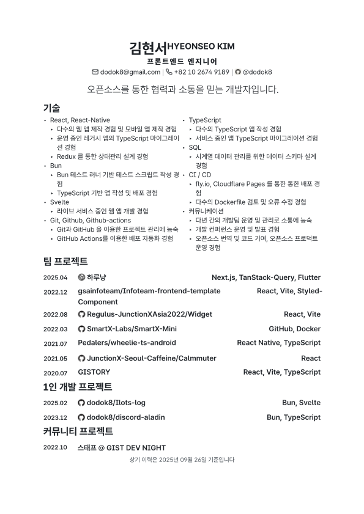

<!-- <picture>
  <source media="(prefers-color-scheme: dark)" srcset="./cover/page-dark-1.svg">
  <source media="(prefers-color-scheme: light)" srcset="./cover/page-light-1.svg">
  
</picture> -->

# résumé

Modern résumé built with Typst

## Dev Environment

- Use VS Code for editor (contains recommended extension and settings).
- Install [mise](https://mise.jdx.dev/) and activate it in your shell.
- Run `mise install` to install the Node.js, pnpm, and Typst versions pinned in `mise.toml`.
- Run `pnpm install --frozen-lockfile` to install development dependencies.
- Install the GitHub CLI (`gh`) and authenticate it for fetching GitHub metadata.
- Run `mise run prebuild` to fetch metadata and icons, then compile with `typst compile resume.typ` or `typst compile portfolio.typ`.
- Run `mise run format` to format supported source and configuration files with Oxfmt.
- Run `mise run lint` for Oxlint, including the Solid TypeScript preset through its
  ESLint-compatible JS plugin support. Use `mise run lint:fix` for automatic fixes.
- Run `mise run check` for format, lint, and script TypeScript checks. CI and the
  optional pre-commit hook run the same checks.
- Optionally run `mise run hooks:install` to enable the pre-commit hook, which runs checks and prebuild. Cover generation runs only when `cover.typ` exists.

Scripts run directly on Node.js using its built-in TypeScript support. All commands
are managed as mise tasks and run from the repository root; Deno and a separate scripts package are no longer required.
CI uses the same mise configuration and deploys the website and PDFs through GitHub Pages.

## Content Sources

| Source          | Web route     | Content                      |
| --------------- | ------------- | ---------------------------- |
| `resume.typ`    | `/resume/`    | Résumé                       |
| `portfolio.typ` | `/portfolio/` | Portfolio                    |
| `graveyard.typ` | `/graveyard/` | Previously operated projects |

`/` is reserved for separate homepage content. Shared profile information stays in
`metadata.typ`. Edit the Typst sources, not generated JSON.

Run `mise run prebuild`, then `mise run export-web` to generate
`assets/.automatic/web/{resume,portfolio,graveyard}.json`. The generated files are
ignored by Git. Each document contains `schemaVersion`, `id`, `title`, `route`,
`updated`, `profile`, and `sections`. Sections contain `heading` and `entries`;
entries contain ISO dates (`from`, `to`), `ongoing`, `title`, and `body`.

Rich content is an array of semantic nodes: `text`, `link`, `strong`, `emph`,
`list-item`, `ordered-item`, `code`, `heading`, `figure`, `image`, `icon`, `super`,
`sub`, and `footnote`. Nested content uses `children`; figures also have `caption`.
`parbreak` and `linebreak` preserve paragraph and line boundaries. Consecutive list
items form a list; nested list items remain inside their parent's `children`.
Image `src` values refer to source paths in the repository, and `alt` can be null.
Icons use their existing query names. PDF layout wrappers and visual styles are
omitted; unsupported elements stop export instead of silently dropping content.

JSON export uses `typst query --input export-web=true` and does not require the
experimental HTML exporter. Without that input, the same sources compile to PDF.
Website rendering and PDF deployment are independent.

## PDF Build and Deployment

Run `mise run build-pdf` to fetch metadata and icons, copy the bundled font and its
license, and compile all three documents into `www/`. This task does not depend on a website
build or JSON export. GitHub Actions runs `check-web` and `build-web`, which include
the PDF and print build tasks, then deploys `web/.output/public/` to Pages.

| Source          | Output              | Published PDF                                              |
| --------------- | ------------------- | ---------------------------------------------------------- |
| `resume.typ`    | `www/index.pdf`     | [Résumé](https://dodok8.github.io/resume/index.pdf)        |
| `portfolio.typ` | `www/portfolio.pdf` | [Portfolio](https://dodok8.github.io/resume/portfolio.pdf) |
| `graveyard.typ` | `www/graveyard.pdf` | [Graveyard](https://dodok8.github.io/resume/graveyard.pdf) |

The existing PDF filenames and URLs remain available independently of web routes.

RIDIBatang is bundled unchanged from [RIDI's official download](https://ridicorp.com/wp-content/themes/ridicorp/css/font/RIDIBatang.otf).
The font copyright notice and the full SIL Open Font License 1.1 are in
`fonts/LICENSE.txt`. Both the font and license are deployed under `www/fonts/`;
CI does not download the font from RIDI.

## Website Development

Run `mise run dev` and open `http://127.0.0.1:5173/`. This prepares the Typst JSON,
PDFs, and print SVGs before starting SolidStart 2. Page components use file-based
routing in `web/src/routes/`:

| Route         | Component                      |
| ------------- | ------------------------------ |
| `/`           | `web/src/routes/index.tsx`     |
| `/resume/`    | `web/src/routes/resume.tsx`    |
| `/portfolio/` | `web/src/routes/portfolio.tsx` |
| `/graveyard/` | `web/src/routes/graveyard.tsx` |

Edit route components for page-specific layouts, `web/src/document.tsx` for shared
document markup, and `web/src/app.css` for styles. Document wrappers have
`document--resume`, `document--portfolio`, and `document--graveyard` classes.
Vite updates UI changes during development. After changing Typst content, rerun
`mise run prepare-web` to regenerate content and print assets.

Run `mise run check-web` for website TypeScript checks or `mise run build-web`
for a static build in `web/.output/public/`. Run `mise run preview` to preview it
on port 4173. Set `SITE_BASE=/resume/` when building for that hosting prefix.
CI obtains the hosting prefix from `actions/configure-pages`, so both custom domains
and repository Pages paths use the same build configuration. Static output includes
all four HTML routes, PDFs with their existing filenames, print SVGs, and font licenses.
The standalone `build-pdf` task remains available independently.

Before the first website build, run `mise run install-browser` to install Chromium.
After building the HTML, `build-web` captures the home page business card in light
mode as `og-card.png`. All routes use this image for Open Graph and Twitter previews.
The capture waits for fonts and card images to load. CI installs Chromium and its
system dependencies before building.

## Browser Printing

`mise run build-print` compiles the same three Typst sources into PDFs and numbered
A4 SVG pages in `www/print/`, with a manifest used by the website build. SVGs are
prepared and loaded before printing. The website displays semantic HTML on screen
and only those SVG pages under `@media print`. The Kobalte print button calls
`window.print()`, using the same print styles as Ctrl+P and the browser print menu.
This prints Typst's page layout; it does not inject a PDF into the print dialog.

Use A4, 100% scale, and disable browser headers and footers for the original layout.
Chrome print output has been checked for all documents (4, 6, and 2 pages).
Other browsers and user print settings may produce different results. PDF downloads
remain available independently. Typst 0.14.0's unescaped URL ampersands in SVG
attributes are escaped during the SVG build so browsers can decode every page.

## Special Thanks

- [shiftpsh](https://github.com/shiftpsh) for his impressive cv design and the [solved.ac](https://solved.ac) service
- [RanolP](https://github.com/RanolP) for typst template
- [Open Color](https://yeun.github.io/open-color/) for good palette
- [Icones](https://icones.js.org/) for easier icon search
- [Iconify](https://iconify.design/) for icon CDN
- [Typst](https://typst.app/) for awesome markup language
- [SolidStart](https://start.solidjs.com/) for awesome fullstack experience
